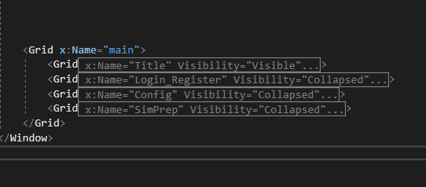

# Fire Force - Eduardo Rojas Sánchez

## Main directory Tree
```
Fire_Force/
├── README.md
├── .gitignore
└── Incendios/
    ├── Incendios/
    │   ├── Images
    │   ├── Audio
    │   └── Mysql
    └── Incendios.sln
```
## Setup
-   Before running the solution, run the create table sql located in the Mysql folder in a Mysql server instance.  
-   Change the connection string in [DatabaseManager.cs](./Incendios/Incendios/DatabaseManager.cs#L15) in line 15 to fit your server.  
-   Verify that you have the package [MysqlConnector](https://mysqlconnector.net/overview/installing/) installed

## Description
The code in ```MainWindow.xml``` is divided in grids:


For visualization porpouses, it's recommended to collapse all grids and only open one at a time.


<br/><br/>

## Possible issues
|              Error name                |                Possible solution                   |
|----------------------------------------|----------------------------------------------------|
|System.Windows.Markup.XamlParseException|Re-add Images and Audios to their respective folders|